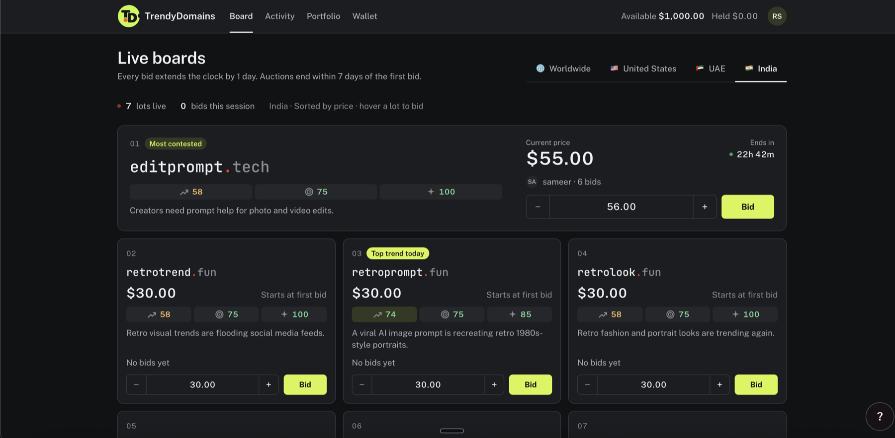

# pitch/

Standalone. Nothing here is part of the submitted repo.

| File | What it is |
|---|---|
| `index.html` | **The deck.** Vertical scroll narrative. Open it in a browser, or visit the hosted link. |
| `deck.html` | The earlier slide-by-slide version. Kept as a fallback for a projector. |
| `script.md` | What to say, with timings and Q&A prep. *Local only, see `.gitignore`.* |
| `facts.md` | The evidence base: cited market data, the full engine spec, the measured funnel, and what we can't claim yet. *Local only, see `.gitignore`.* |
| `img/` | Screenshots referenced by the page. Empty until you drop them in. |

## Design

**Capsule** from `zarazhangrui/frontend-slides` — pill geometry, 2px ink outline, candy
palette on a cream canvas.

Three typefaces, not the usual two:

- **Bodoni Moda** — headlines. Sentence case, ink only, never coloured.
- **Space Grotesk** — body, labels, pills.
- **Archivo Expanded 800, tabular figures** — every numeral on the page.

That third face is a deliberate break from Capsule's two-face rule. Bodoni is a didone:
its thin strokes vanish at a glance, which is exactly wrong for a number somebody has to
read from the back of a room. Archivo at width 112 is heavy, wide and unmistakable.
Every figure uses `.num`, so changing one line changes all of them.

## The pipeline section

`#engine` is the centrepiece: a sticky stage where scroll drives a horizontal rail of
seven cards. The survivor counter underneath falls continuously as you scroll, so "how it
works" and "how much we threw away" are the same gesture. Rejected categories drop out of
each card as it activates.

Section height is computed in JS (`n * 92vh`), so adding or removing a stage needs no CSS
change.

## Numbers

Every figure in `index.html` is now measured or cited — there are no placeholders left.
Internal numbers come from production run id 6 (11 Sep 2026, four regions) and the pool as
read on 16 Sep 2026; external ones are sourced in `facts.md`.

## The placeholder mechanism (still wired up)

Two mechanisms, both coral with a dotted underline:

1. **In the markup** — wrapped in `<span class="ph">`. Search for `class="ph"`.
2. **In the pipeline counter** — the `stageData` array near the bottom of the file:

```js
const stageData = [
  {v:9313, ok:true },   // sources — merged keyword count
  {v:4200, ok:false},   // score & rank — sent to screen
  ...
```

`ok:false` renders the counter as a placeholder. Replace the value, flip the flag, and it
turns black. The counter is also shown as a placeholder mid-scroll, because between two
stages the figure is an interpolation rather than anything measured.

## Screenshot slots

`#board` has a `.frame` with a dashed placeholder. To use a real screenshot, replace the
`<div class="inner">…</div>` block with:

```html

```

## Behaviour

Scroll, or click the dots on the right to jump between chapters. Thin coral progress bar
at the top. Reveals fire on intersection; counters tick up; score bars fill on entry.
Everything degrades correctly under `prefers-reduced-motion`.

No build step, no dependencies. One file plus whatever you put in `img/`.

## Photographs on the example slide

The before/after portraits are inline SVG illustrations, not photographs. To swap in real
ones, drop `img/before.jpg` and `img/after.jpg` into this folder and replace each `<svg>`
in the `.photopair` block with an `` tag (the exact markup is in an HTML comment
directly above it).

Use a photo the team owns, ideally one of the five of you run through the trending prompt.
That is authentic, it is clearly ours to publish, and it makes a better moment on stage than
a stranger's picture would.
